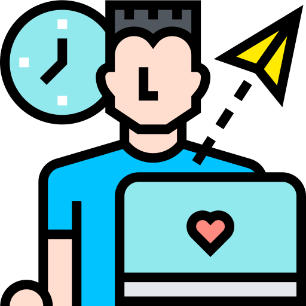
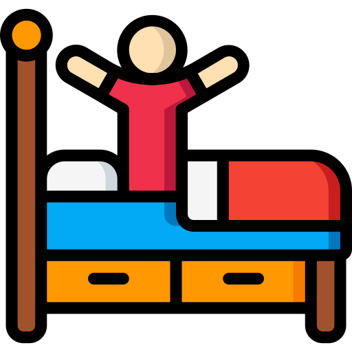
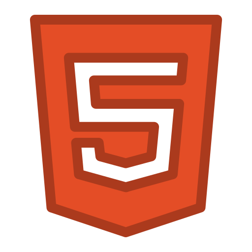
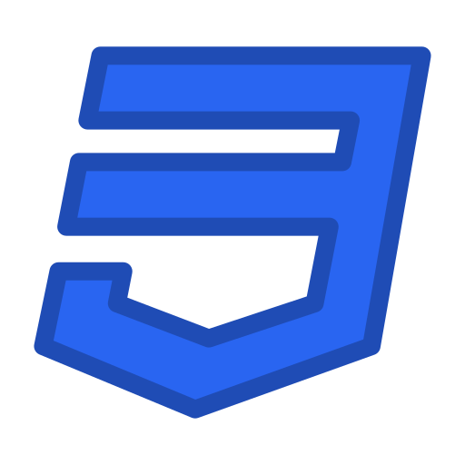

## I'm a freelancer and Frontend Developer 

### About me:

- I love to turn on the computer when I wake up 
- I love programming and I do it a lot 
- I love Linux operating systems 

### My stack technologies:

